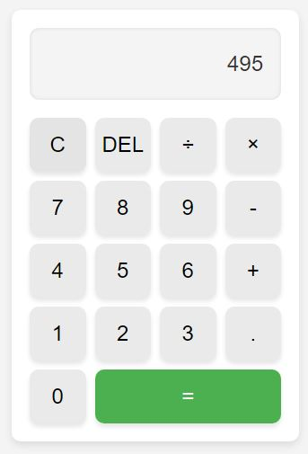

# Calculator App

A simple and beautifully designed calculator app built using HTML, CSS, and JavaScript. The app provides basic arithmetic operations and is designed with a clean, modern user interface.

## Features

- **Basic Arithmetic Operations**: Add, subtract, multiply, and divide.
- **Responsive Layout**: The calculator adjusts nicely to different screen sizes.
- **Clear Design**: Minimalist, light theme with rounded buttons and smooth interactions.
- **Easy to Use**: Supports mouse clicks for button input and displays the calculation history on the screen.

## Demo



## Technologies Used

- **HTML**: Defines the structure and layout of the calculator.
- **CSS**: Provides the styling for the UI, including button design, grid layout, and shadows.
- **JavaScript**: Implements the core functionality for performing arithmetic operations, clearing the screen, and deleting numbers.

## How to Use

1. Clone this repository:

    ```bash
    git clone https://github.com/your-username/calculator-app.git
    ```

2. Open the `index.html` file in any modern web browser.

3. Start using the calculator by clicking the buttons to perform operations.

## Files

- **index.html**: Contains the structure of the calculator.
- **style.css**: Includes the styling for the calculator interface.
- **script.js**: Handles the logic for calculations, screen updates, and button interactions.

## Preview

You can view a live version of the calculator here: [Live Demo](https://your-live-demo-link.com)

## Screenshots


## License

This project is licensed under the MIT License. Feel free to use, modify, and distribute it as you wish.

---

Made with ❤️ by [Your Name](https://github.com/your-username)


### Instructions:
- Replace the links (like `https://github.com/your-username/calculator-app.git`) with your actual repository URL.
- If you're hosting the app online, update the live demo link.
- Add screenshots or demos of the app to enhance the `README`.